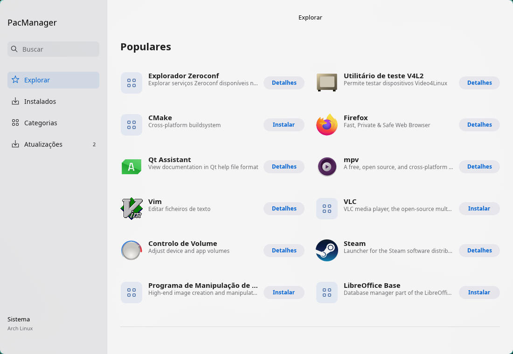
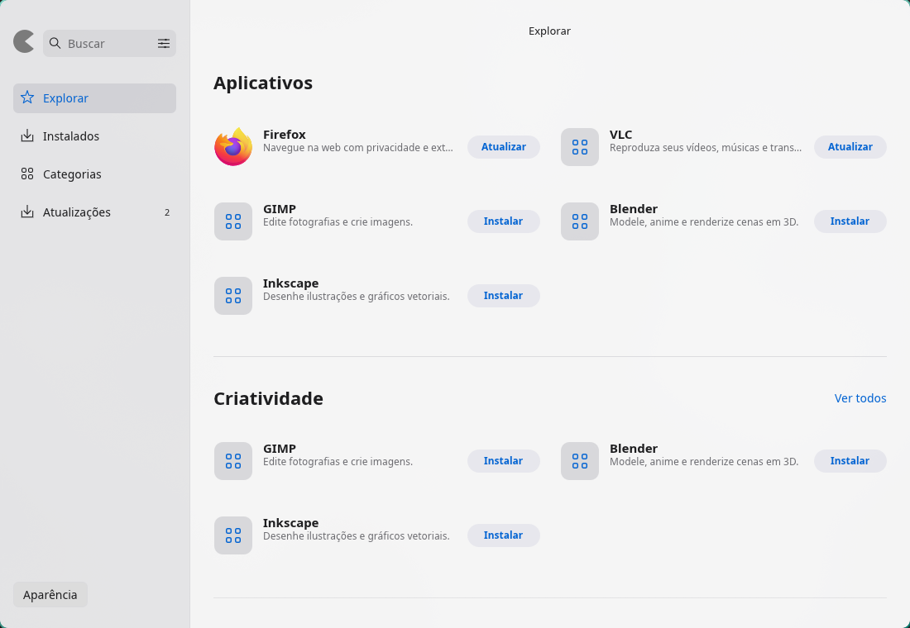
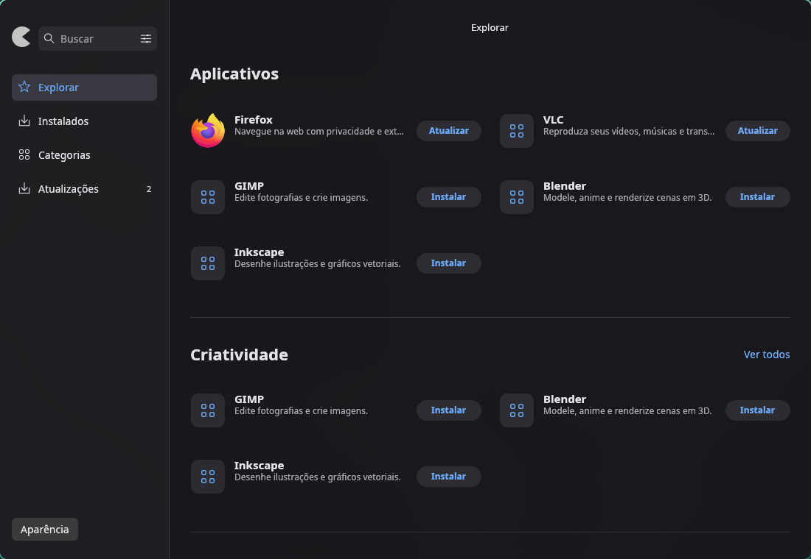
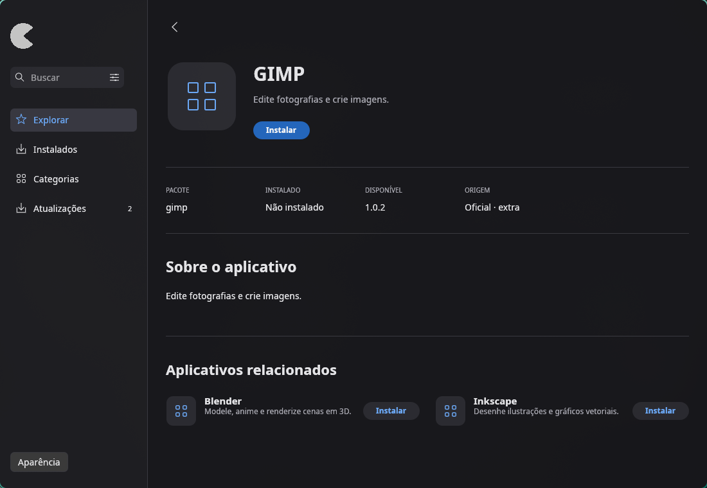
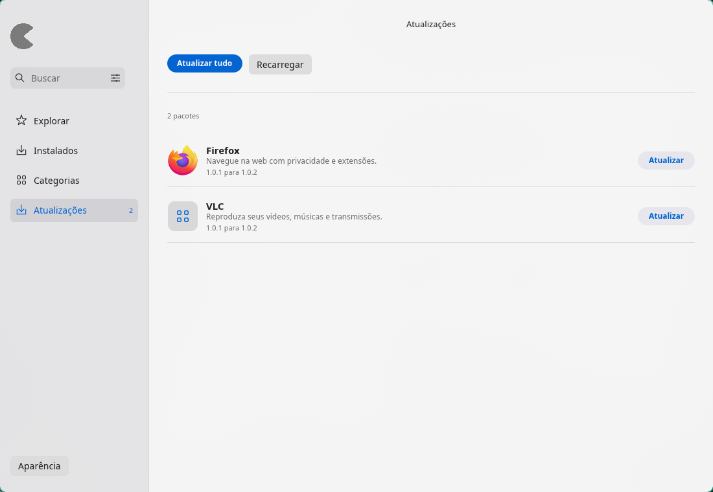
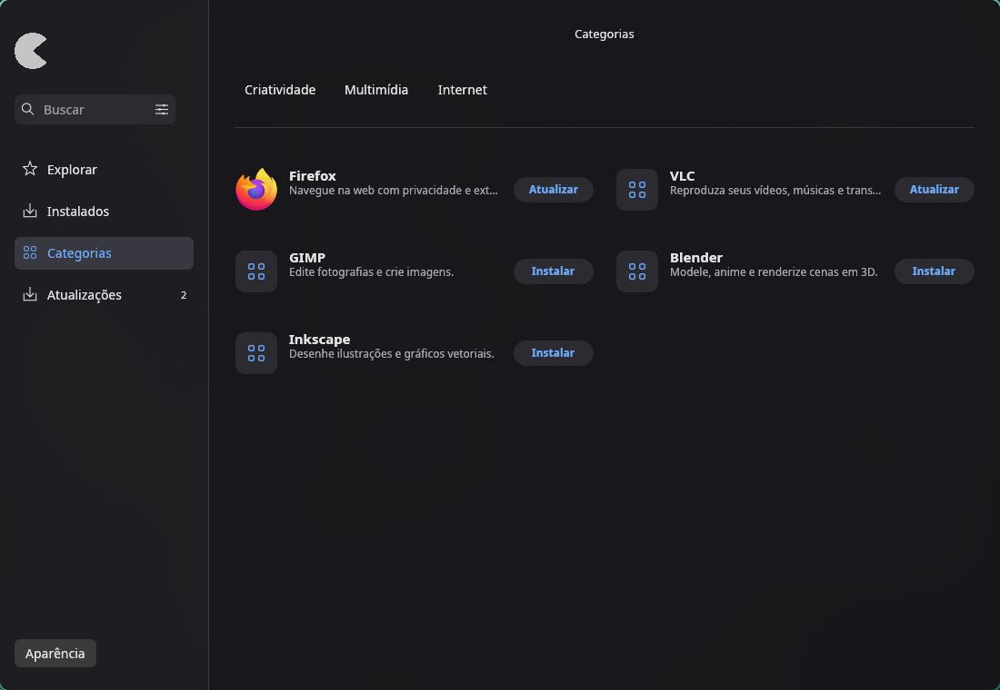
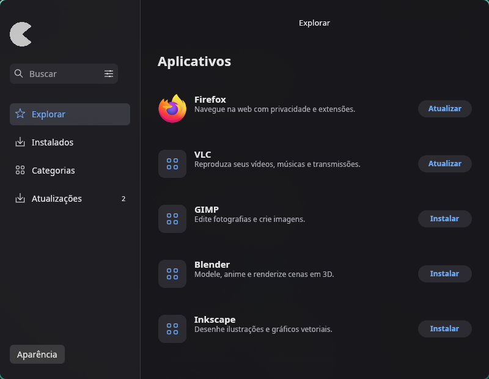

<div align="center">

# PacManager

Uma loja de aplicativos para Arch Linux e derivados, feita em Rust.

[](https://github.com/8bury/pacmanager/releases/latest)
[](https://github.com/8bury/pacmanager/actions/workflows/ci.yml)
[](LICENSE)

[Baixar](https://github.com/8bury/pacmanager/releases/latest) · [Guia de uso](docs/usage.md) · [Reportar um problema](https://github.com/8bury/pacmanager/issues)

</div>



Encontre aplicativos, consulte os pacotes instalados e acompanhe as atualizações em uma interface inspirada na Mac App Store. O PacManager usa os repositórios configurados no seu sistema e permite buscar no AUR.

## O que você pode fazer

- Explorar aplicativos por categoria e popularidade, com metadados do AppStream e pkgstats.
- Buscar pacotes oficiais e incluir resultados do AUR.
- Ver aplicativos instalados, com a opção de mostrar bibliotecas e componentes do sistema.
- Abrir os detalhes de um aplicativo e consultar versão, origem e sugestões relacionadas.
- Instalar, remover e atualizar pacotes pelo terminal, com os prompts do pacman e yay.
- Alternar entre os temas claro, escuro e do sistema. A preferência fica salva.
- Experimentar a interface no modo de demonstração, sem alterar pacotes.

A interface usa egui/eframe com OpenGL e funciona em sessões Wayland e X11. Esta é a primeira versão pública, `0.1.0`.

## Screenshots

As capturas desta seção usam o modo de demonstração, com dados fictícios. Os ícones disponíveis dependem dos aplicativos e temas instalados no sistema.

| Explorar no tema claro | Explorar no tema escuro |
| --- | --- |
|  |  |

| Detalhes de um aplicativo | Atualizações disponíveis |
| --- | --- |
|  |  |

<details>
<summary>Ver categorias e janela compacta</summary>





</details>

## Instalação

### Requisitos

- Arch Linux ou uma distribuição baseada em Arch, com `pacman`.
- Sessão gráfica Wayland ou X11 com suporte a OpenGL.
- `sudo` configurado para as operações dos repositórios oficiais.
- Um terminal compatível: `kitty`, `foot`, `xterm`, `alacritty` ou `gnome-terminal`.
- `yay`, caso você queira instalar, remover ou atualizar pacotes do AUR.

Execute o PacManager como seu usuário normal. Ele abre um terminal quando precisa autenticar ou confirmar uma operação.

### Binário da release

Baixe `pacmanager-v0.1.0-linux-x86_64.tar.gz` e `SHA256SUMS` na [página da release](https://github.com/8bury/pacmanager/releases/tag/v0.1.0). Na pasta dos downloads:

```sh
sha256sum --check SHA256SUMS
tar -xzf pacmanager-v0.1.0-linux-x86_64.tar.gz
cd pacmanager-v0.1.0-linux-x86_64
install -Dm755 pacmanager "$HOME/.local/bin/pacmanager"
install -Dm644 pacmanager.desktop "$HOME/.local/share/applications/pacmanager.desktop"
```

Garanta que `~/.local/bin` esteja no seu `PATH`. Depois, abra pelo menu de aplicativos ou execute `pacmanager` no terminal.

O binário é destinado a Linux x86_64 com glibc. A versão inicial foi compilada e verificada no CachyOS. Para outras arquiteturas, compile a partir do código.

### Compilar a partir do código

Você precisa de Rust 1.98 ou mais recente, Cargo e ferramentas de compilação. No Arch, `base-devel` fornece essas ferramentas.

```sh
git clone https://github.com/8bury/pacmanager.git
cd pacmanager
cargo build --locked --release
./target/release/pacmanager
```

Para instalar o binário compilado, use os comandos de `install` acima, substituindo `pacmanager` por `target/release/pacmanager` e `pacmanager.desktop` por `assets/pacmanager.desktop`.

## Experimente sem alterar o sistema

```sh
pacmanager --demo
pacmanager --demo --theme dark
pacmanager --demo --demo-app firefox
pacmanager --demo --demo-tab updates
```

Ao executar pelo Cargo, passe os argumentos depois de `--`:

```sh
cargo run --release -- --demo --theme dark
```

Use `--theme light`, `--theme dark` ou `--theme system` para escolher a aparência apenas naquela execução. `--help` mostra as opções disponíveis.

## Como as operações funcionam

As consultas rodam em segundo plano. Instalações, remoções e atualizações abrem um terminal para você conferir o comando, autenticar e confirmar as mudanças. O PacManager não armazena senhas nem responde aos prompts automaticamente.

Prefira **Atualizar sistema completo** para manter o sistema sincronizado. Atualizações individuais usam as bases locais, sem sincronizá-las isoladamente. Consulte o [guia de uso](docs/usage.md) para os comandos executados, as limitações e os detalhes do catálogo e cache.

## Desenvolvimento

```sh
cargo fmt --check
cargo test --locked
cargo clippy --locked --all-targets -- -D warnings
cargo build --locked --release
```

Os testes usam dados controlados e não executam transações reais. O teste opcional de integração com o AUR exige `pacman` e acesso à rede:

```sh
cargo test --locked --test aur_search -- --ignored
```

`pacmanager --check` consulta o backend e o catálogo do sistema sem instalar, remover ou atualizar pacotes.

| Arquivo | Responsabilidade |
| --- | --- |
| `src/app.rs` | Interface e navegação |
| `src/backend.rs` | Consultas e operações com pacman e yay |
| `src/catalog.rs` | AppStream, popularidade e cache |
| `src/model.rs` | Modelos de pacotes |
| `src/design.rs` | Temas e componentes visuais |
| `src/icons.rs` | Ícones locais e entradas de desktop |

Encontrou um erro? [Abra uma issue](https://github.com/8bury/pacmanager/issues) com a versão do PacManager, sua distribuição, o terminal usado e os passos para reproduzir. Contribuições são bem-vindas.

## Licença

[MIT](LICENSE). As referências visuais estão documentadas em [docs/design/references.md](docs/design/references.md).
